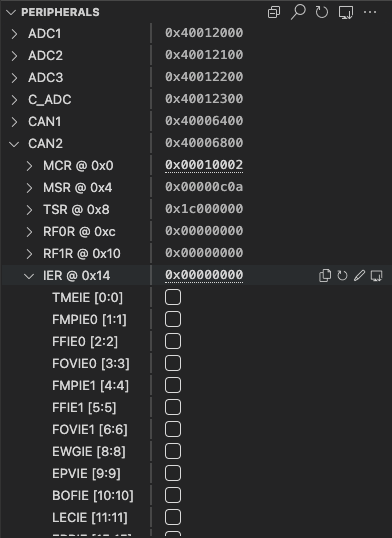

# Peripheral Inspector

This standalone SVD Viewer extension is extracted from [cortex-debug](https://github.com/Marus/cortex-debug) and allows
you to view and change on-chip peripheral settings.

## Usage

The **Peripheral Inspector** displays information about peripheral registers.



Depending on the context, the following icons may be visible:

| Icon | Use it to |
|------|-----------|
|  | Collapse currently viewed peripherals |
|  | Open search bar to find specific properties |
|  | Refresh the current view |
|  | Export peripheral registers |
|  | Update the register value |

## Specifying SVD Files

The SVD Viewer extension uses [System View Description](http://www.keil.com/pack/doc/CMSIS/SVD/html/index.html) (SVD) files to display information about the selected part, including the Cortex Peripherals view.

Choose one of the following methods to specify your SVD file in your `launch.json` configuration(s):

### Use the CMSIS pack asset service

Set the `definitionPath` configuration variable to a qualified pack reference in the form `<vendor>::<device family pack>@<version>` e.g.:

```json
{
    ...
    "definitionPath": "NXP::K32L3A60_DFP@15.0.0"
    ...
}
```

If the pack supports multiple devices and/or processors, you will be prompted to select these. Alternatively, set them in your configuration using the optional `deviceName` and `processorName` variables:

```json
{
    ...
    "definitionPath": "NXP::K32L3A60_DFP@15.0.0",
    "deviceName": "K32L3A60VPJ1A",
    "processorName": "cm4"
    ...
}
```

**TIP:** The pack reference and device name can be automatically derived if you use the [Arm Device Manager extension in VS Code](https://marketplace.visualstudio.com/items?itemName=Arm.device-manager) using these commands:

```json
{
    ...
    "definitionPath": "${command:device-manager.getDevicePack}",
    "deviceName": "${command:device-manager.getDeviceName}"
    ...
}
```

### Install a Cortex Debug Support Pack

Find a [Cortex Debug Support Pack](https://marketplace.visualstudio.com/search?term=Cortex-Debug%3A%20Device%20Support%20Pack&target=VSCode&category=All%20categories&sortBy=Relevance) for your device and install it. You can then specify just the `deviceName` variable in your launch configuration:

```json
{
    ...
    "deviceName": "STM32F439BI"
    ...
}
```

### Specify the path to your SVD file

You can obtain an SVD file from a [CMSIS pack](https://developer.arm.com/tools-and-software/embedded/cmsis/cmsis-packs) or from your device manufacturer. For example use [these instructions](https://community.st.com/s/question/0D50X00009XkWDkSAN/how-does-st-manage-svd-files) for ST devices.

Other vendors may ship SVD files when you install their software or device packs or you could write your own custom SVD file.

Once you have the SVD file, specify the location of it in your `launch.json` using the `definitionPath` variable:

```json
{
    ...
    "definitionPath": "${workspaceFolder}/STM32F103.svd"
    ...
}
```

### Extending Peripheral Inspector

It is possible to extend the Peripheral Inspector with new file extension providers in your VSCode extension. This method will provide reading new file formats and load the peripherals information into the Peripheral Inspector.

```json
{
    ...
    "definitionPath": "${workspaceFolder}/STM32F103.<customFileExtension>"
    ...
}
```

For more details about the implementation, please check the [Extending Peripheral Inspector](./docs/extending-peripheral-inspector.md) document.

## Settings

All variable key names used to extract data from debug launch configurations can be modified. This allows variable name clashes to be avoided as well as the need to duplicate configuration entries.

The following list outlines the setting names and default values:

- `peripheral-inspector.definitionPathConfig` - Debug configuration key to use to get the SVD path (default `definitionPath`)
- `peripheral-inspector.deviceConfig` - Debug configuration key to use to get the device name (default: `deviceName`)
- `peripheral-inspector.processorConfig` - Debug configuration key to use to get the processor name (default: `processorName`)
- `peripheral-inspector.packAssetUrl` - Base URL for CMSIS pack assets (default: `https://pack-content.cmsis.io`)
- `peripheral-inspector.svdAddrGapThreshold`- If the gap between registers is less than this threshold (multiple of 8), combine into a single read from device. -1 means never combine registers and is very slow (default: `0`, means combine but no gaps)

Additionally the following settings can be used to customize the Peripheral Inspector:

- `peripheral-inspector.saveLayout`- Save layout of peripheral view between sessions (default: `true`)
- `peripheral-inspector.ignorePeripherals` - List of peripheral names to ignore. They will not show up in the tree view and no values are read from the target system. The user can add variables by using the context menu (**Workspace only**) in the tree view, or by setting them manually in the **User** and **Workspace** preferences.

## Contributing

We welcome contributions on [GitHub](https://github.com/eclipse-cdt-cloud/vscode-peripheral-inspector).
Check our [contribution guidelines](./CONTRIBUTING.md) for more info.
This open-source project is part of [Eclipse CDT Cloud](https://eclipse.dev/cdt-cloud/).
